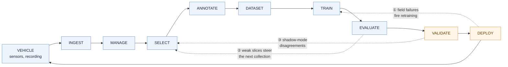

---
hide:
  - navigation
---

# Data Flywheel for Autonomous Systems

A continuous loop that turns field data from off-road autonomous machines into measurably better models — and sends the machines back out to collect what the models still get wrong.

<strong>Nakshatra Vyas</strong> · Data Engineer — Autonomous Systems · October 2026 
Technical assessment · Zensomy Autonomous Technologies

---

## The loop

A pipeline runs and stops. A flywheel stores momentum — each turn makes the next turn cheaper and more productive. **The three dotted edges are the design.** Without them this is a data pipeline that happens to be run repeatedly.

---

## Where to start

-   :material-sitemap:{ .lg .middle } **Technical Design**

    ---

    The architecture end to end — ingestion, selection, training, CI/CD and the cloud layout. Eight diagrams, including the worked clip-ranking example.

    [:octicons-arrow-right-24: Read it](technical-design.md)

-   :material-scale-balance:{ .lg .middle } **Design Document**

    ---

    Every major decision, the alternative it beat, and the cost accepted. Opens with a requirement coverage matrix; closes with a 47-row trade-off register.

    [:octicons-arrow-right-24: Read it](design-document.md)

-   :material-code-braces:{ .lg .middle } **Implementation**

    ---

    Working Python for the data-selection component — the part of the design that decides which footage is worth paying a human to label. Runs with one Docker command.

    [:octicons-arrow-right-24: Read it](implementation.md)

-   :material-presentation:{ .lg .middle } **Presentation**

    ---

    Ten to fifteen minutes on the architecture, the decisions, the trade-offs, scalability, and what makes this a flywheel rather than a pipeline.

    [:octicons-arrow-right-24: Attached as PDF](#)

---

## The constraint that shapes everything

!!! danger "You cannot upload it"

    **400 GB** per machine per day against a rural uplink of about **5 Mbps** is **178 hours of upload for 8 hours of driving.** The backlog grows without bound. So the vehicle decides what leaves it.

!!! warning "You cannot label it"

    Annotation is the real budget. Roughly **1%** of recorded footage can be labelled. Choosing that 1% well is worth more than any other single optimisation in the loop.

!!! success "So selection is the product"

    Four signals — the vehicle logged a problem, the model was unsure, two sensors disagreed, the scene is rare — scored, de-duplicated, and spent against a hard budget with a per-vehicle cap.

---

## Three claims this design makes

| | Claim | Where it is argued |
|---|---|---|
| 1 | Model uncertainty alone cannot find the dangerous failures — a model that is **confident and wrong** reports no uncertainty at all | [Design Document §2](design-document.md) |
| 2 | An aggregate evaluation score hides the regressions that matter; gating must be **per slice** | [Design Document §3](design-document.md) |
| 3 | The artifact that trains is not the artifact that runs — **compilation changes accuracy**, and it changes it most on the rare slices | [Design Document §4](design-document.md) |

---

Built with MkDocs Material. Diagrams are Mermaid, rendered from the same Markdown that is submitted.

