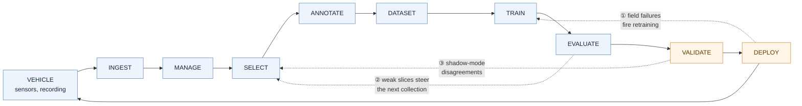

---
hide:
  - navigation
---

# Data Flywheel for Autonomous Systems

A continuous loop that turns field data from off-road autonomous machines into measurably better models - and sends the machines back out to collect what the models still get wrong.

<strong>Nakshatra Vyas</strong> · Data Engineer - Autonomous Systems · October 2026 
Technical assessment · Zensomy Autonomous Technologies

---

## The loop

A pipeline runs and stops. A flywheel stores momentum - each turn makes the next turn cheaper and more productive. **The three dotted edges are the design.** Without them this is a data pipeline that happens to be run repeatedly.

---

## Where to start

-   :material-sitemap:{ .lg .middle } **Technical Design**

    ---

    How the system is built, start to finish. Mostly diagrams.

    [:octicons-arrow-right-24: Read it](technical-design.md)

-   :material-scale-balance:{ .lg .middle } **Design Document**

    ---

    Why it is built that way. Each choice, and what was chosen instead.

    [:octicons-arrow-right-24: Read it](design-document.md)

-   :material-code-braces:{ .lg .middle } **Implementation**

    ---

    Working code that picks which footage to label. Runs with one Docker command.

    [:octicons-arrow-right-24: Open on GitHub](https://github.com/nakshatravyas/zensomy-data-flywheel/tree/main/3-implementation)

-   :material-presentation:{ .lg .middle } **Presentation**

    ---

    The whole design in ten to fifteen minutes. PDF, with speaker notes.

    [:octicons-arrow-right-24: Open on GitHub](https://github.com/nakshatravyas/zensomy-data-flywheel/tree/main/4-presentation)

Built with MkDocs Material. Diagrams are Mermaid, rendered from the same Markdown that is submitted.

