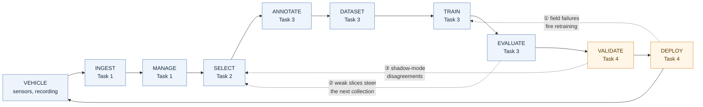
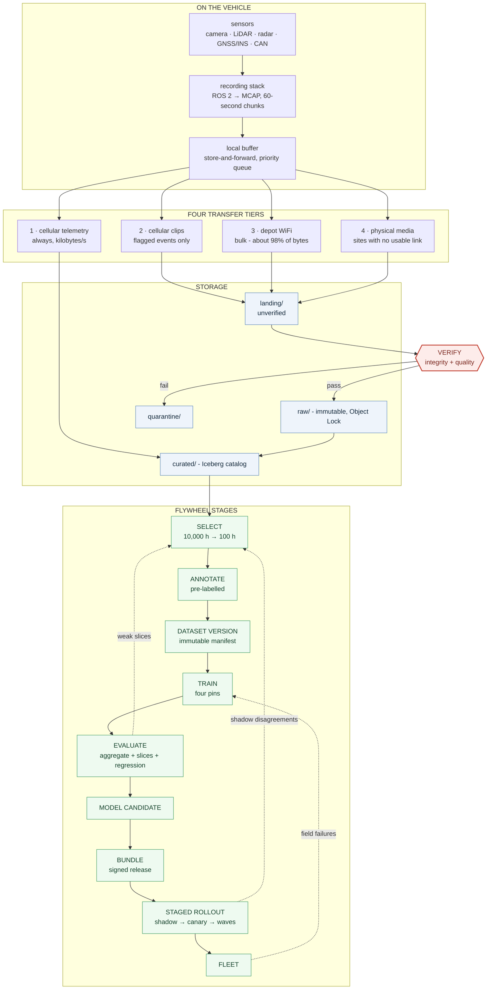
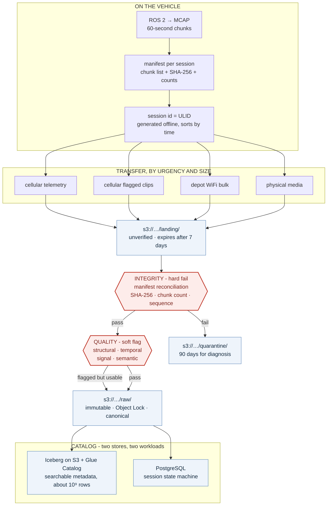
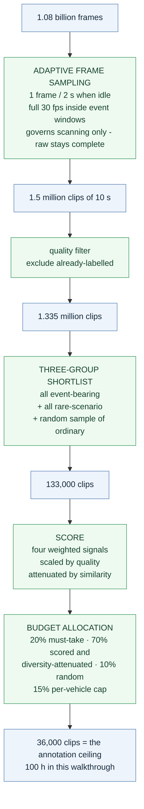
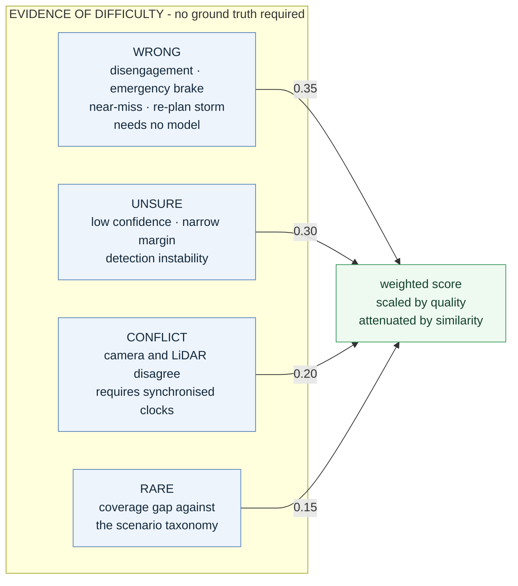
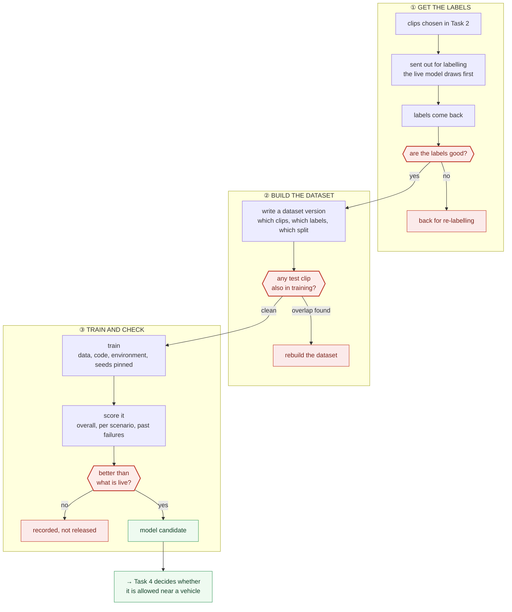
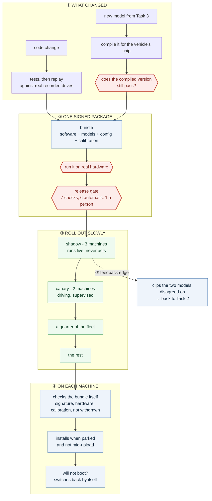
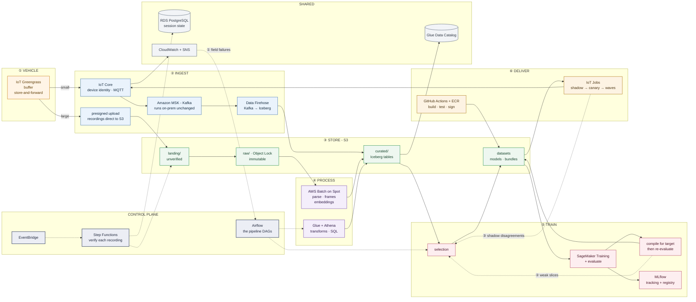

# Technical Design - Data Flywheel for Autonomous Systems

**Nakshatra Vyas** · Data Engineer - Autonomous Systems · October 2026

**Deliverable 1** - a high-level architecture covering the complete Data Flywheel.
Decisions, assumptions and trade-offs are in [`2-design-document/`](../2-design-document/).

---

## 1 · The flywheel

A pipeline runs and stops. A flywheel stores momentum - each turn makes the next turn cheaper and more productive. **The feedback edges are the design.** Without them this is a data pipeline that happens to be run repeatedly.

### The three feedback edges

| | Edge | Mechanism |
|---|---|---|
| ① | Field failures → retraining | A deployed model's slice-level failure rate crosses a threshold and triggers the pipeline that replaces it |
| ② | Weak evaluation slices → next collection | A slice that scores badly raises its weight in the next selection cycle |
| ③ | Shadow disagreements → selection pool | Frames where candidate and production models disagree are difficult by construction, and become annotation candidates |

### Why the returns compound rather than repeat

- As the model improves, the share of footage it already handles grows - so **the value of a randomly chosen hour falls every cycle.** Selection must get smarter simply to hold its value constant. That makes selection the component whose returns compound, not a cost measure bolted on.
- The production model pre-labels clips before annotation, so **a better model makes annotation cheaper** - the same budget buys more labelled hours each cycle.
- Every release contributes new regression tests, new replay sessions and new scenario weights. **The test suite strengthens as a by-product of shipping.**

---

## 2 · The system end to end

### What each stage owes the next

| Stage | Produces | Guarantee it must hold |
|---|---|---|
| **Ingestion** | Verified, identified, catalogued recordings | Nothing in `raw/` is incomplete, unidentified or mutable |
| **Selection** | A ranked list of clip references | Nothing valuable was silently dropped; every choice is explainable |
| **Dataset** | An immutable manifest | The exact data behind any model is recoverable years later |
| **Training** | A model candidate plus an evaluation report | No candidate exists without evidence attached |
| **Deployment** | A signed, staged bundle | Nothing unvalidated reaches a machine |
| **Fleet** | Telemetry, failures, disagreements | The next cycle knows what to collect |

> Throughout this document, **a red node is a gate that fails closed.** No stage produces output by default; output exists only because a specific check passed.

---

## 3 · Data ingestion and management

**The constraint is arithmetic.** 400 GB per vehicle-day against a rural uplink is **178 hours of upload for 8 hours of driving**, and cellular is priced per gigabyte. Streaming everything to the cloud is not a rejected trade-off; it is impossible. The transfer architecture follows from that.

**Metadata is recorded at four levels** - fleet, vehicle, session, chunk - so fleet-wide facts are not repeated per chunk and chunk-level facts are not lost inside session summaries.

**Calibration version is a first-class required field.** A sensor mount that shifts two centimetres without re-calibration silently invalidates every LiDAR-to-camera projection from that moment onward. Nothing fails, and no error is raised.

---

## 4 · Data selection and active learning

**The constraint.** 10,000 hours recorded against 100 hours that can be annotated.

Everything below is therefore built around **the ratio and the mechanism**, never around a particular ceiling. The ceiling is one number in a config file; the question the design answers is **how to concentrate a fixed amount of human attention on the material that carries the most information**, whatever that amount turns out to be.

### The four signals

| Signal | Source | Available before a model exists |
|---|---|---|
| **WRONG** | Vehicle logs | ✅ Yes - the strongest signal needs no model |
| **UNSURE** | Model output | ❌ No |
| **CONFLICT** | Cross-sensor comparison | ⚠️ Partially - needs synchronised clocks |
| **RARE** | Catalog coverage counts | ✅ Yes |

Four signals rather than one because **uncertainty cannot detect confident error** - the model certain and wrong. That is the highest-risk failure mode, because the machine proceeds at full speed into it, and only WRONG and CONFLICT can see it.

### Worked ranking example

Eight representative clips from one selection cycle. This is the concrete output the pipeline produces: a ranked list with every term visible, so any selection can be explained.

> `score = (0.35·WRONG + 0.30·UNSURE + 0.20·CONFLICT + 0.15·RARE) × quality ÷ similarity`

| # | Clip | WRONG | UNSURE | CONFLICT | RARE | Qual | Sim | **Score** | Outcome |
|---|---|---|---|---|---|---|---|---|---|
| 1 | `veh03` disengagement, dust plume | 1.00 | 0.71 | 0.44 | 0.92 | 0.95 | 1.0 | **0.750** | **Must-take** |
| 2 | `veh01` emergency brake, low sun | 0.90 | 0.55 | 0.30 | 0.40 | 0.98 | 1.0 | **0.588** | Selected |
| 3 | `veh04` near-miss - LiDAR sees obstacle, camera does not | 0.80 | 0.12 | 0.78 | 0.55 | 0.93 | 1.0 | **0.516** | Selected |
| 4 | `veh02` wet descent, steep grade, no event | 0.00 | 0.48 | 0.10 | 0.95 | 1.00 | 1.0 | **0.307** | Selected - rare bucket |
| 5 | `veh03` same dust afternoon as #1, 90 s later | 1.00 | 0.68 | 0.41 | 0.92 | 0.95 | **2.4** | **0.310** | Deferred - diversity |
| 6 | `veh05` mud on lens, hardware fault confirmed | 0.60 | 0.88 | 0.91 | 0.30 | **0.21** | 1.0 | **0.147** | Rejected - quality |
| 7 | `veh01` straight-line travel, clear day | 0.00 | 0.08 | 0.05 | 0.05 | 1.00 | 1.0 | **0.042** | Not selected |
| 8 | `veh02` straight-line travel, clear day | 0.00 | 0.06 | 0.04 | 0.08 | 1.00 | 1.0 | **0.038** | Selected - random 10% |

**What each row demonstrates:**

- **#1** - A disengagement is the strongest available evidence: a trained operator judged the machine unsafe. It needs no model to detect and enters the must-take bucket unconditionally.
- **#3 - the confident error.** `UNSURE` is 0.12: the model is *certain*. Uncertainty sampling would discard this clip entirely. `WRONG` and `CONFLICT` are what surface it, and it is the most dangerous category in the set - the machine proceeds at full speed into a situation it has misread.
- **#5 - diversity attenuation.** Identical raw signals to #1, but a similarity divisor of 2.4 because near-neighbours were already selected. Without this term, one dusty afternoon consumes a large share of the budget. The clip is deferred, not discarded - it returns to the pool next cycle.
- **#6 - quality as a multiplier, not an additive term.** Every difficulty signal is high, but the sensor is faulty. Annotating it would teach the model about a dirty lens. A multiplier suppresses the clip regardless of how strongly it scores elsewhere; an additive penalty would not. The clip instead raises a maintenance alert.
- **#8 - the random reservation.** Scores below the threshold and is selected anyway, from the 10% random bucket. Without it, every labelled clip would be one the model struggled with, and performance under normal conditions would become unmeasurable.

---

## 5 · Dataset and training pipeline

**What this stage produces is a candidate**, not a deployed model. Training answers *is this better*; deployment answers *is this safe to release*.

Three questions have to be answered yes before a trained model is allowed to exist as a candidate: **are the labels good, is the test set clean, and is the model actually better.** Each one is a gate, and each gate stops the work rather than flagging it.

### The three gates, and why each one exists

| Gate | What it asks | Why it is there |
|---|---|---|
| **① Label quality** | Do two people labelling the same clip agree? | Labels are what the model learns from. Bad labels do not announce themselves later - they just become a model that is quietly wrong |
| **② Leakage** | Is any test clip also in the training set? | If it is, the score comes back high and means nothing. Checked by **content**, because the same drive re-ingested under a new name is one recording wearing two identities |
| **③ Comparison** | Is it better than the model in the field? | A model can gain overall and still get worse at night, or in dust. Those are the conditions that cost the most, so losing ground on any one of them counts as a loss |

Nothing proceeds by default. A failed run is recorded as completely as a successful one, so the reason a model did not ship is as traceable as the reason one did.

### Two decisions worth stating plainly

**Train and test are split by session, and the split never moves.** Frames a second apart are almost the same picture, so splitting frame by frame puts a clip in training and its near-twin in test - the score then looks excellent and says nothing about the field. Sessions are assigned once, by a hash of the session ID, and stay put. If splits were redrawn each time, last version's test data would become this version's training data, and every past model comparison would quietly become meaningless.

**Models are judged per scenario, not on one overall number.** A scenario that is a small share of the test set moves the overall score by a small amount, so a serious failure inside it is invisible in the headline. The rare scenarios are the expensive ones, which is exactly why they get their own pass or fail.

---

## 6 · CI/CD and deployment

**The constraint.** Ship continuously, while making it impossible for an unchecked model or an unchecked line of code to reach a machine in a field.

A vehicle is not a server, and four differences decide the whole design:

| The machine | So the pipeline must |
|---|---|
| can injure someone | keep a named person in the final approval |
| is offline for days | leave an instruction the machine collects, not push an update at it |
| cannot be recreated | make rollback work with no network and nobody present |
| is busy when the update arrives | let the machine choose when to install |

### The four ideas in that picture

**① One package, never a loose model.** A model's accuracy depends on code that sits around it - how the image is prepared, what threshold filters the results. Change that code and the model behaves differently without the model changing. Ship them separately and combinations end up in the field that nobody ever tested together.

**② The model that trains is not the model that runs.** It gets shrunk to run on a small chip, and shrinking it costs accuracy - most of all on dim, low-contrast scenes, which are exactly the dust and night clips that matter. So the shrunk version is scored again, on the real hardware, before it counts.

**③ The gate is checked twice.** Once in the pipeline, and again by the machine before it installs anything. A pipeline can be bypassed by someone with enough access. A machine that refuses unsigned bundles cannot be talked into accepting one.

**④ Rollout buys evidence, and so does failure.** Shadow runs the new model on live sensors with its decisions recorded but never acted on - real evidence at no risk. Every frame where the new and old models disagreed is a hard frame by definition, and goes back into the pool worth labelling. **Validating a model produces the data that improves the next one.**

Each stage needs both a time threshold and a metric threshold before it promotes. Time alone can pass while the numbers slide; metrics alone can be satisfied by two easy hours in good weather.

### The one thing that cannot be rolled back

A bad bundle can be withdrawn, but the six hours it ran already produced six hours of recordings. So **every recording stores the bundle version that made it.** Withdraw a bundle and one query finds everything it touched. Without that field the contamination is permanent and invisible.

---

## 7 · Cloud architecture

The major services, and how they interact. The organising split: a **data plane** that bytes flow through, and a **control plane** that decides when things run.

**Solid lines are data. Dotted lines are decisions.** The three numbered dotted edges are the flywheel - the only paths that carry information backwards.

### How the pieces interact

| | What passes | Why it works that way |
|---|---|---|
| Vehicle → IoT Core → Kafka | Telemetry and events, kilobytes | Small and frequent. Needs ordering, replay, several independent consumers |
| Vehicle → S3 directly | Recordings, gigabytes | A 10 GB file never enters a message bus, and never touches compute we operate |
| Kafka → Firehose → Iceberg | Validated messages | Managed landing - no streaming job to write or run |
| S3 event → EventBridge → Step Functions | A reference, not a payload | Verification starts when data arrives, not on a schedule |
| Step Functions → `raw/` or `quarantine/` | A promotion decision | A partial upload never becomes canonical data |
| Airflow → selection → dataset → training | Clip IDs, then a manifest | Dependency-rich and periodically backfilled - DAG-shaped work |
| Training → compile → bundle → IoT Jobs | A signed release | What reaches a vehicle is one versioned unit |
| Fleet → CloudWatch → Airflow | Slice failure rates | The deployed model's own failures trigger its replacement |

### What each service is for

| Service | Doing what |
|---|---|
| **IoT Greengrass** | Buffers on the machine, forwards when connected, deploys the recording stack |
| **IoT Core** | One certificate per machine; carries the desired bundle version |
| **Amazon MSK - Kafka** | Telemetry and events. Chosen because it also runs at a site with no cloud link |
| **Data Firehose** | Reads Kafka, writes Iceberg. No streaming job to operate |
| **S3** | One storage substrate. `raw/` is write-once under Object Lock |
| **Glue Data Catalog** | Metastore for the Iceberg tables |
| **RDS PostgreSQL** | Session state, upload progress, fleet inventory |
| **AWS Batch on Spot** | Heavy work - parsing, frame extraction, GPU embeddings |
| **Glue · Athena** | Scheduled transforms, table maintenance, SQL with no cluster |
| **SageMaker Training** | Managed spot training with checkpointing |
| **MLflow** | Experiment tracking and the model registry |
| **GitHub Actions · ECR · Signer** | Build, test, replay, sign the bundle |
| **IoT Jobs** | Staged rollout, against the version each machine reports |
| **EventBridge** | One bus - S3 events, schedules, alarms, manual triggers |
| **Step Functions** | Per-recording verification: thousands of short runs a day |
| **Airflow** | The pipeline DAGs: selection, dataset build, train, evaluate, register |
| **CloudWatch + SNS** | Fleet inventory, data-quality alarms, the retraining trigger |

## 8 · Implemented component

The **data selection and active-learning pipeline** - section 4 of this document, as working code. Scoring, diversity-aware ranking and budget-constrained selection, with deterministic tests and example input and output.

See [`3-implementation/`](../3-implementation/).
