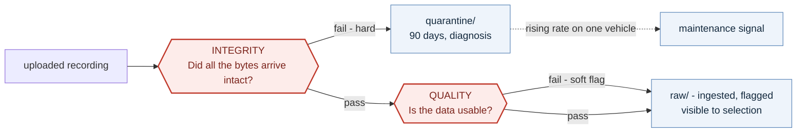
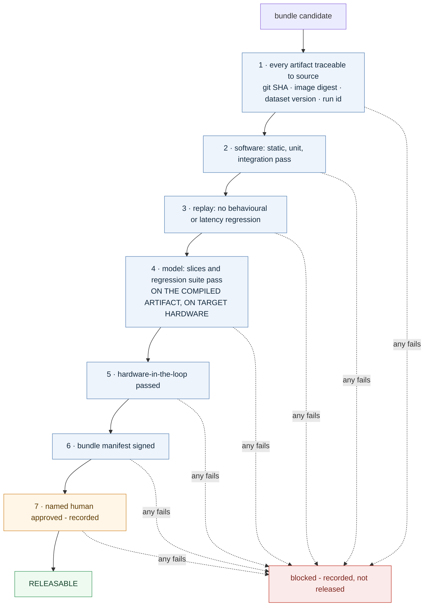

# Design Document - Data Flywheel for Autonomous Systems

**Nakshatra Vyas** · Data Engineer - Autonomous Systems · October 2026

**Deliverable 2** - the major design decisions and the assumptions behind them.
The architecture itself is in `1-TECHNICAL-DESIGN.md`; the code is in `3-implementation/`.

Every decision below is stated as **what was chosen and what it was chosen over**, because the brief states that identified trade-offs matter more than the stack selected.

---

## Assumptions

Stated explicitly, as the brief invites. Each one is load-bearing somewhere.

| # | Assumption |
|---|---|
| 1 | Off-road machines in GNSS-degraded, connectivity-poor environments |
| 2 | Machines **return to a depot most operating days**, with a high-bandwidth local network. **The most load-bearing assumption in the design** - §1.1 gives the fallback if it is false |
| 3 | About 8 operating hours per vehicle-day, and **400 GB per vehicle-day** across 4–6 cameras, LiDAR, radar, GNSS/INS and CAN |
| 4 | On-vehicle software is ROS 2; recordings are written as MCAP |
| 5 | Sensor clocks are synchronised by GNSS or PTP, and residual skew is **measured, not assumed zero** |
| 6 | Annotation is performed off-platform and integrated over an API. Building an annotation tool is out of scope |
| 7 | Cloud is AWS; §5 marks where the reasoning is portable |
| 8 | **Tens of vehicles now, low hundreds within 2–3 years.** Explicitly not 10,000 - every sizing decision follows from this |
| 9 | **Annotation is the dominant marginal cost**, and the share of recorded data that can be annotated shrinks as the fleet grows. The ceiling is a configuration value, never a constant in the design |
| 10 | Raw data is retained rather than deleted: 12 months instantly accessible, then deep archive |
| 11 | A trained perception model exists from cycle one; §2 covers operating before one does |

---

## 1 · Ingestion and management

**The constraint is arithmetic, not preference.** 400 GB per vehicle-day against a rural uplink is **178 hours of upload for 8 hours of driving**, and cellular is priced per gigabyte. Streaming everything to the cloud is not a trade-off that was considered and rejected; it is impossible. Every decision below follows from that.

### 1.1 How data is transferred

| Decision | Instead of | Why |
|---|---|---|
| **Four transfer tiers** split by urgency and size - cellular telemetry, cellular flagged clips, depot WiFi bulk, physical media | One upload path | Cellular carries only what must be timely; depot WiFi carries ~98% of bytes at near-zero marginal cost |
| **Resumable multipart upload**, chunk-level | Whole-file transfer | A dropped link mid-transfer resumes rather than restarts |
| **Priority queue on the vehicle**, not FIFO | First-in-first-out buffer | When the buffer fills or a link returns briefly, flagged data goes first and routine data waits |

### 1.2 How recordings are organised and identified

| Decision | Instead of | Why |
|---|---|---|
| **MCAP, 60-second chunks** | Whole-session files; raw rosbag | MCAP is indexed, so session metadata is readable without downloading the whole file - which is what makes cataloguing affordable. Chunking makes upload resumable and bounds the loss from a corrupt write |
| **ULID session identifiers generated on-vehicle** | Server-assigned IDs; UUIDv4 | A machine in a field cannot reach a server to request an ID. ULIDs are collision-free offline and sort by time |
| **Hive-style partitioning** - `vehicle_id=…/date=…/session=…` | Flat prefixes | Queries skip irrelevant partitions entirely; this is the main query-performance lever |
| **Idempotent keys throughout** | Retry bookkeeping and dedup logic | Over unreliable links, unknown completion state is the normal case. Deterministic keys make retry unconditionally safe and collapse a whole class of failure handling |

### 1.3 How metadata is associated

| Decision | Instead of | Why |
|---|---|---|
| **Four metadata levels** - fleet, vehicle, session, chunk | Flat metadata per file | Fleet-wide facts are not duplicated across millions of chunks, and chunk-level facts are not lost inside session summaries |
| **Manifest sidecar *and* a catalog** | Catalog only | The manifest makes a session self-describing even if the catalog is lost or has to be rebuilt - and it is what integrity verification reconciles against |
| **Calibration version as a first-class required field** | Assume calibration is stable | A mount that shifts slightly without re-calibration silently invalidates every LiDAR-to-camera projection from that moment on. **Nothing fails and no error is raised.** Models trained on the mixture degrade and the cause is untraceable unless the version was recorded at ingestion |
| **Clock-synchronisation quality recorded per session** | Assume clocks agree | A moving machine displaces observations when sensor clocks drift apart. Downstream consumers need to know how much to trust cross-sensor alignment |

### 1.4 How integrity and quality are maintained

**These are two different problems and conflating them is the common error.**

A dusty lens fails quality and is kept - it is exactly the material selection wants. A truncated upload fails integrity and must never become canonical data.

| | Integrity | Quality |
|---|---|---|
| Question | Did all the bytes arrive intact? | Is the data usable? |
| Checks | Manifest reconciliation, SHA-256 per chunk, chunk count, sequence continuity | Structural, temporal, signal-level, semantic |
| On failure | **Hard fail** → quarantine | **Soft flag** → ingested, annotated, visible downstream |

| Decision | Instead of | Why |
|---|---|---|
| **Separate hard-fail and soft-flag paths** | One validation step | A corrupt transfer must never become canonical data. A dusty lens must not be thrown away - it is exactly the material §2 wants |
| **`landing/` → `raw/` promotion**, raw immutable with Object Lock | Write directly to the final location | A partial upload never becomes canonical. Corrections are new versions, never edits - which is what makes dataset manifests (§3.1) and replay testing (§4.1) safe |
| **Quarantine rather than discard** | Drop failed data | A rising quarantine rate on one vehicle is a hardware fault signal, not noise |

### 1.5 How unreliable connectivity is handled

| Decision | Instead of | Why |
|---|---|---|
| **Durable local buffer, store-and-forward** | Upload-on-generate | A cloud or link outage delays ingestion; it does not lose data. This is the single most important reliability property in the system, and it lives on the vehicle rather than in the cloud |
| **Exponential backoff with jitter** | Fixed retry interval | Prevents an entire fleet reconnecting after an outage from arriving as a synchronised thundering herd |
| **Idempotent retry** | Transactional upload protocol | See §1.2 - this is why retry is safe at all |
| **Physical media tier for prolonged blackouts** | Software-only solution | Days or weeks fully offline is an operational problem, not a software one. A technician swapping a drive is standard practice at remote sites |

### 1.6 How it scales as vehicles increase

Four axes, scaled independently:

| Axis | Absorbed by | What actually binds |
|---|---|---|
| More vehicles | S3 and the streaming layer scale without intervention; processing queues deepen | Not the cloud, at this volume |
| More data per vehicle | Storage lifecycle; the four transfer tiers | **Depot upload bandwidth** |
| More consumers and queries | Iceberg partitioning; serverless query concurrency | Query **cost** before query capacity |
| More vehicle variants | Per-variant schemas and bundles; the compatibility field already exists | Bench hardware for validation |

---

## 2 · Data selection and active learning

**The constraint.** Far more is recorded than can ever be annotated, and the limit is financial rather than technical - more compute does not relieve it. So the question is never *how much can we annotate*, it is **where do we concentrate a fixed amount of human attention.**

Random sampling answers it badly. Most footage is a machine driving straight across a flat dry field, which the stack already handles. And it **degrades over time**: as the model improves, the share of footage it already handles grows, so the expected value of a random hour falls every cycle. Selection has to get smarter simply to hold its value constant - which is why its returns compound.

| Decision | Instead of | Why |
|---|---|---|
| **2.1 Four signals - WRONG, UNSURE, CONFLICT, RARE** | Uncertainty sampling alone | Uncertainty cannot detect **confident error** - the model certain and wrong, which is the highest-risk case. Only WRONG and CONFLICT see it. WRONG also needs no model, which solves the cold start |
| **2.2 Weighted linear score** | A learned ranking model | Every selection is explainable, and it works from cycle one with no training data about selection itself |
| **2.3 Quality as a multiplier** | Quality as a subtracted penalty | A faulty sensor scores high on several signals at once. Only a multiplier suppresses the clip however strongly it scores elsewhere |
| **2.4 Adaptive frame sampling** | Fixed-rate subsampling | Sampling governs scanning, not storage; events are found in logs rather than frames; and the rate rises to full frame rate inside an event window. Without all three, a brief safety-critical moment can be sampled away |
| **2.5 Three-group shortlist** | Rank on the cheap score, take the top N | At shortlist time only the cheap signals exist. Ranking on those admits almost only event clips and excludes what the expensive signals are there to find |
| **2.6 Diversity-attenuated selection** | Pure ranked selection | One dusty afternoon produces hundreds of near-identical high-scoring clips. Ranking alone spends the whole budget on that afternoon |
| **2.7 Budget split - must-take, scored, random** | Fully scored selection | The random share keeps evaluation honest, and is the only way a failure mode no signal was designed to find can surface |
| **2.8 Per-vehicle cap** | Uncapped allocation | One machine with a dirty lens would otherwise take the whole budget. The cap doubles as a maintenance signal |
| **2.9 Clock-synchronisation gate on CONFLICT** | Trusting cross-sensor comparison | Badly synchronised sensors appear to disagree on every frame, so the signal is disabled rather than believed |
| **2.10 Fixed-length clips** | Single frames; whole sessions | Matches annotator throughput and prevents the same moment being bought twice |

> **The point most likely to be challenged.** "Take the top 10% by score" is the intuitive shortlist, and it is wrong - the cheap signals available at that stage are not the signals you are trying to find. A filter that pre-selects for what you already know makes the expensive stage confirm rather than discover.

---

## 3 · Dataset and training pipeline

**What this stage produces is a *candidate*,** not a deployed model. Training answers *is this better*; deployment answers *is this safe to release*. Those are different questions with different evidence, and keeping them separate is what makes the gate in §4 meaningful.

### 3.1 Dataset creation and versioning

| Decision | Instead of | Why |
|---|---|---|
| **A dataset version is an immutable manifest of references**, written once | A folder of copied files | A folder is mutable. Someone removes a bad clip, corrects fifty labels, appends a batch - the name stays `v4` and *"what data produced this model"* becomes unanswerable. References keep versioning cheap enough that engineers actually create versions |
| **Content hash per sample, verified at load** | Trusting the reference | If a referenced file ever changes, the run aborts rather than silently training on different data |
| **Sampling weights, not duplication**, for class and scenario imbalance | Physically copying rare samples | Duplication makes the manifest misrepresent its own contents and corrupts every count derived from it |

### 3.2 Splits - the decision that silently destroys evaluation if it is wrong

| Decision | Instead of | Why |
|---|---|---|
| **Session-level splits** | Random split over frames | Consecutive frames are near-duplicates. A random split puts one frame in training and its twin in test, and the score comes back **high, stable, and unrelated to field performance.** It does not present as an error; it presents as success |
| **Permanently sticky assignment** - `hash(session_id)`, never re-drawn | Re-splitting each build | If splits are redrawn, last version's test data becomes this version's training data, and **every historical model comparison becomes invalid.** The loss is unrecoverable - the models cannot be re-measured against a split that no longer exists |
| **Held-out sites and dates in the test split** | Same-distribution test split | Measures generalisation rather than interpolation. A new field, next month, is what deployment actually is |
| **An independent leakage check as its own pipeline step** | Trusting the split implementation | The rule can be satisfied exactly while leakage occurs: a session re-ingested under a new ID is one physical drive with two identifiers, hashed onto opposite sides. The check compares **content** - exact hashes plus near-duplicate embeddings - not identifiers |

### 3.3 Reproducible training

| Decision | Instead of | Why |
|---|---|---|
| **Four pins: dataset hash · git SHA · container image digest · config and seeds** | Pinning code and data only | The environment pin is the one usually weakened. **An image tag is a mutable pointer** - `:latest` resolves differently over time, and CUDA, driver and library versions shift with no record in the run |
| **Statistical, not bitwise, reproducibility - stated explicitly** | Deterministic GPU kernels | Deterministic GPU kernels cost real throughput for a property rarely needed. Claiming stronger reproducibility than has been paid for is worse than claiming none, because someone will rely on it |

### 3.4 Model evaluation

| Decision | Instead of | Why |
|---|---|---|
| **A frozen evaluation set**, refreshed quarterly and deliberately | A continuously extended set | A growing exam means successive models sat different tests and their scores are not comparable. Each refresh re-scores the current production model so a valid baseline survives |
| **Gate on per-slice metrics, not the aggregate** | A single aggregate score | A small slice contributes little to the aggregate, so a severe regression confined to it is invisible. **A real result from this design: +1.2 points overall, −5.7 in dust.** For a machine in a dry field that model is worse, and the aggregate hid it. The rare slices are exactly the costly ones |
| **A regression suite of real past field incidents**, which only grows | Slice metrics alone | Specific known failures must not return regardless of summary statistics. Entries are never removed, because the conditions that produced them have not stopped existing |

### 3.5 Experiment tracking

| Decision | Instead of | Why |
|---|---|---|
| **Every run recorded automatically** - inputs, metrics, artifacts, lineage | Recording runs that seem important | A run that is not recorded did not happen. A pipeline permitting unrecorded runs accumulates models whose origin cannot be established |
| **MLflow, self-hosted** | Weights & Biases (SaaS) | No per-seat cost, and field recordings and model artifacts remain inside the organisation's own account |

### 3.6 Model and artifact management

| Decision | Instead of | Why |
|---|---|---|
| **The registry is a gate, not a store** - stages `candidate → validated → shadow → production → archived` | A model directory | Storage is object storage. What the registry adds is a **stage** and a **lineage record** tying a model to the exact data, code and environment that produced it |
| **Registration rejected without an attached evaluation report**, enforced in the API | A review checklist | A rule enforced by convention is a rule that holds until the first deadline |

### 3.7 Re-running when new data arrives

| Decision | Instead of | Why |
|---|---|---|
| **Three triggers:** accumulated new data, field performance, schedule | Retrain on every arrival | Retraining on a handful of new clips burns GPU hours learning noise - but a serious field regression must not wait for a volume threshold. The performance trigger is **feedback edge ①** expressed as a mechanism |
| **A weekly scheduled floor** | Trigger-only execution | A pipeline that runs only when needed is a pipeline that is broken when needed |

### 3.8 Training throughput

| Decision | Instead of | Why |
|---|---|---|
| **Sequential shards for training reads** | Per-sample object reads | One request per file starves the GPU, which then sits waiting on the network. The manifest stays authoritative; shards are a regenerable materialisation of it |

---

## 4 · CI/CD and deployment

**The constraint.** Support continuous development while preventing an unvalidated model or software change from reaching a vehicle. The resolution is not to slow development down - it is to make the path to a vehicle **narrow and automatic**, so that speed is bounded by the gate rather than by caution.

**Four properties of the target decide most of what follows**, and none of them hold for a server:

| Property | Consequence |
|---|---|
| It can injure someone | A named human stays in the production approval path |
| It is offline for days at a time | Desired-state convergence, not push deployment |
| It cannot be recreated | Rollback must work with **no network and no human** |
| It is busy when the update arrives | The vehicle decides when to install, not the pipeline |

### 4.1 Software changes

| Decision | Instead of | Why |
|---|---|---|
| **Replay against recorded field sessions in CI** | Synthetic fixtures only | Regression testing against the real distribution, catching behavioural divergence and latency regressions that no unit test produces. It is possible **only because the raw zone is immutable and complete** - a Task 1 decision made for unrelated reasons |
| **A curated, versioned replay corpus that only grows** | Replaying everything, or a fixed sample | Scenario coverage from the taxonomy, plus every session associated with a past field incident |
| **Images addressed by digest** | Image tags | Same reasoning as §3.3 |

### 4.2 ML and model changes

| Decision | Instead of | Why |
|---|---|---|
| **Re-evaluate the compiled artifact on target hardware** | Trusting the training-time evaluation | **The artifact that trains is not the artifact that runs.** It is exported, quantised and compiled for the vehicle's accelerator, and **quantisation degrades low-contrast inputs disproportionately** - exactly the rare, costly slices. In this design v7 passed dust at FP32 and failed it at INT8. Skip this step and the model you validated and the model you deployed are different objects, with the deployed one carrying a report saying it passed |
| **Provenance verification before compilation** | Trusting the candidate's score | A candidate with incomplete lineage is rejected regardless of its metrics |

### 4.3 The release unit, and preventing unvalidated deployment

**"Validated" is given an operational definition** - seven conditions, all of which must hold before a bundle can be promoted.

Conditions 1 to 6 are automatic. Condition 7 is deliberately not - and the reasoning is below.

| Decision | Instead of | Why |
|---|---|---|
| **The release unit is a bundle** - software image + compiled models + config + calibration schema + hardware target, signed as one | Deploying software and models independently | A model's accuracy depends on pre- and post-processing that live in the software. Change the normalisation constants or the NMS threshold and the model behaves differently **without the model changing.** A model validated against software v12 has no established behaviour under v13 |
| **A gate of seven conditions** - traceability, software tests, replay, compiled-model evaluation, hardware-in-the-loop, signature, named human approval | An approval checklist | This is the operational definition of "validated". Six are automatic; conditions 1–6 produce the evidence, and condition 7 records accountability |
| **Hardware-in-the-loop before release** | Software testing only | **There is no staging server here - the staging environment for a robot is a physical machine.** Thermal throttling, memory pressure from the recording stack competing with perception, and embedded latency budgets cannot be reproduced off-target |
| **A named human approves production promotion** | Fully automated promotion | Auto-promotion is correct where failure is reversible and bounded. Here it is neither - the blast radius is physical machines near people. The approver is not re-deriving evidence; they are accountable, and the signature records that |

### 4.4 Enforcement, rollout and rollback

| Decision | Instead of | Why |
|---|---|---|
| **The gate is enforced in the pipeline *and* on the vehicle** | Pipeline enforcement alone | The two fail independently. A pipeline can be bypassed with sufficient access; **a vehicle that refuses unsigned bundles cannot be made to accept one remotely.** The vehicle independently checks signature, hardware target, calibration schema and the revocation list |
| **Shadow before canary** | Canary directly | The candidate runs on live sensor data with its outputs logged and never actuated - real field evidence at **zero operational risk** |
| **Shadow disagreements fed back into the selection pool** | Discarding them after validation | A frame on which two independently trained models disagree is difficult by construction. **Validating a model produces the data that improves the next one** - feedback edge ③ |
| **Time-in-stage *and* metric thresholds at every transition** | Either alone | A metric threshold alone can be satisfied by two easy hours; a time threshold alone can be satisfied while metrics degrade |
| **Dual-slot A/B with automatic revert on failed boot health check** | In-place update | Rollback works with **no network and no human** - which is exactly the state a bad bundle creates - and is bounded in minutes rather than waiting on a diagnosis |
| **Download decoupled from installation** | Install on receipt | Installation proceeds only when parked, with sufficient power margin, no pending upload backlog, and the operator informed |
| **Bundle version recorded in every recording's session metadata** | Deployment logs only | **Data cannot be rolled back.** A defective model that ran six hours produced six hours of recordings. With this field, every artifact it produced is identifiable in one query; without it the contamination is permanent and undetectable |
| **A separate, bounded configuration path** - schema-validated, bounds-checked in CI and again on the vehicle | Everything is a bundle | Requiring a full release for a threshold change creates pressure to bypass the process, which produces **undocumented on-machine overrides - invisible, and strictly worse.** Anything the models were validated against is excluded from this path by schema |

---

## 5 · Cloud architecture

Managed by default. At tens of machines the load is not the hard part - operating clusters with a small team is. Two rules follow: **buy managed unless managed forces a design compromise**, and **build only the selection and curation logic.**

### 5.1 The services, and why each one

| Service | Chosen over | Why |
|---|---|---|
| **IoT Greengrass** | A custom agent | Store-and-forward when disconnected, and remote deployment of the recording stack without physical access to a machine in a field |
| **IoT Core** | A self-run MQTT broker | One X.509 certificate per machine, and a device shadow that carries the desired bundle version - which is exactly the desired-state convergence deployment needs |
| **Amazon MSK - Kafka** | A cloud-native managed queue | **Portability.** Some customer sites - mining especially - will have no dependable link to any cloud, and the streaming layer is the one component that must then run locally. Kafka runs anywhere |
| **Glue Schema Registry** | Validating downstream, or not at all | A firmware change that adds a field or alters a unit is caught at ingest instead of surfacing weeks later as unexplained data |
| **Data Firehose** | A streaming Spark job | Buffering, file sizing and compaction into Iceberg, with no job to write, deploy or operate |
| **S3** | A distributed filesystem | One substrate for every lifecycle state. **Object Lock** on `raw/` enforces immutability at the storage layer, which dataset manifests and replay testing both silently assume |
| **Iceberg + Glue Data Catalog** | Plain Parquet; Redshift | Schema evolution when a sensor is added, snapshot IDs so a dataset can record the catalog state it was built against, and ACID writes with no coordination layer to build |
| **RDS PostgreSQL** | Aurora Serverless; DynamoDB | The operational state is modest and heavily joined. Aurora's elasticity solves a problem this workload does not have; DynamoDB would trade a write-scale problem we do not have for a query-rigidity problem we would acquire |
| **AWS Batch on EC2 Spot** | On-demand; a Kubernetes cluster | Every job is already idempotent and restartable, so interruption is cheap - a large saving for a property the pipeline had to have anyway |
| **Glue · Athena** | EMR; Redshift | Scheduled transforms and SQL over Iceberg with no cluster to own. EMR Serverless is the upgrade when job complexity outgrows Glue's abstractions |
| **SageMaker Training** | Self-managed GPU instances | Per-second billing, managed spot with checkpointing, and interruption handled by the service rather than by code the team maintains |
| **MLflow, self-hosted** | Weights & Biases; SageMaker Model Registry | No per-seat cost, and field recordings and model artifacts stay inside the organisation's own account. Keeping the registry here too means a model's lineage lives in one system - lineage in two places is lineage nobody trusts |
| **Step Functions** | Airflow for everything | Per-recording verification is thousands of short independent runs a day with branching. Billed per transition, so an idle week costs nothing |
| **Airflow (MWAA)** | Step Functions for everything | The pipeline is dependency-rich and routinely re-run over historical ranges. Expressing a backfillable DAG as a state machine costs more in authoring pain than the service costs to run |
| **EventBridge** | Point-to-point wiring | S3 events, schedules, fleet alarms and manual triggers all enter in one place |
| **GitHub Actions · ECR · AWS Signer** | CodePipeline | Better ecosystem, and OIDC removes long-lived credentials. Images addressed by digest; bundles signed with a key whose public half is on every vehicle |
| **CloudWatch + SNS** | A third-party observability stack | Fleet inventory, runtime health and data-quality alarms in the account that already holds everything else |

### 5.2 The seven things the brief asks about

| | Approach |
|---|---|
| **Scalability** | Managed and serverless by default, so growth is a configuration change rather than a capacity project. The four axes - more machines, more data per machine, more queries, more vehicle variants - scale independently. The cloud is not what binds first - depot bandwidth and the annotation budget are |
| **Reliability** | The vehicle is the first line: it buffers locally and forwards when connected, so a cloud outage delays ingestion rather than losing data - and nothing in AWS provides that. Containment is architectural rather than operational: idempotent keys, dead-letter queues, and a quarantine zone so bad data stops instead of propagating. Single region, with bundles and model artifacts copied to a second one so a regional failure cannot leave the fleet without a way to deploy |
| **Cost** | Storage dominates at every scale, and it grows with bytes retained rather than with machines - so the lever is deciding what to keep, not tuning jobs. That makes selection a cost lever as well as a quality one: the same mechanism that decides what is worth annotating decides what is worth keeping in instant-access storage |
| **Data storage** | One S3 substrate with prefixes by lifecycle state, Object Lock on raw, and automatic tiering since recordings are written once and read rarely. Two stores because the questions differ - Iceberg for search across billions of rows, PostgreSQL for transactional state |
| **Compute** | Spot by default for anything interruptible, which every job already is. Managed training rather than a cluster. One GPU at a time, because annotation throughput binds long before training capacity does |
| **Security** | One certificate per machine, scoped so a vehicle can only write its own data. Separate KMS keys per data class. No long-lived credentials - SSO for people, OIDC for CI. And face and plate blurring on the annotation export, because machines in agriculture and construction record people and the exposure is largest where data leaves the account |
| **Automation** | Event-driven ingestion rather than scheduled sweeps, one event bus, and infrastructure as code throughout so `dev` and `prod` are the same definitions with different values |

## 6 · Implemented component

The **data selection and active-learning pipeline** is implemented as working code.

Chosen because it is the component whose returns compound, it is what the role description describes as the ideal candidate's work, it requires no infrastructure to demonstrate, and its scoring functions are deterministic and therefore genuinely testable.

Source, README, tests, and example input and output are in `3-implementation/`.
